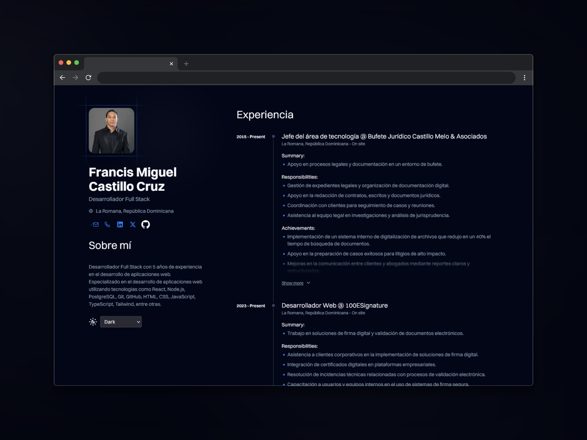
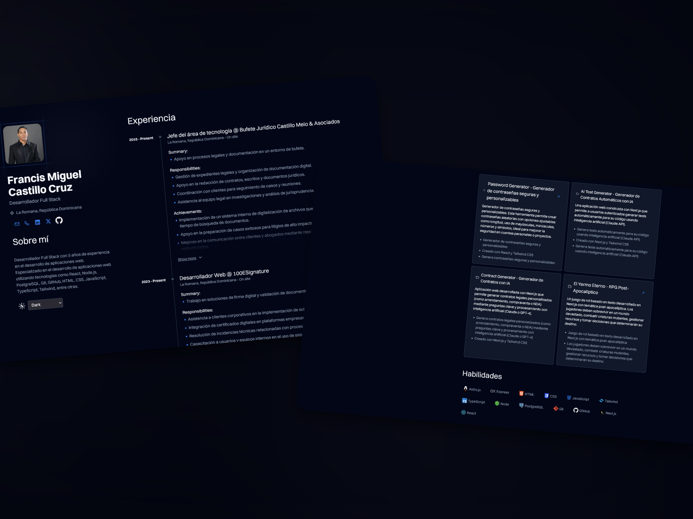

# Curriculum Vitae

Este es un **fork** del proyecto [dev-portfolio](https://github.com/Smilesharks/dev-portfolio) adaptado para mi currículum personal, disponible en línea en [franciscurriculum.netlify.app](https://franciscurriculum.netlify.app/).

## ⚡ Tecnologías principales

- **Framework:** Astro
- **Lenguaje:** TypeScript
- **Formato de datos:** [JSON Resume](https://jsonresume.org/schema)

## 📂 Estructura del proyecto

- `src/`: Código fuente de la aplicación
- `public/`: Archivos estáticos
- `resume.json`: Datos del CV siguiendo el esquema de JSON Resume

## 🚀 Despliegue

El proyecto está desplegado en **Netlify**. Para ejecutarlo localmente:

```bash
git clone https://github.com/tuusuario/tu-repositorio.git
cd tu-repositorio
npm install
npm run dev

